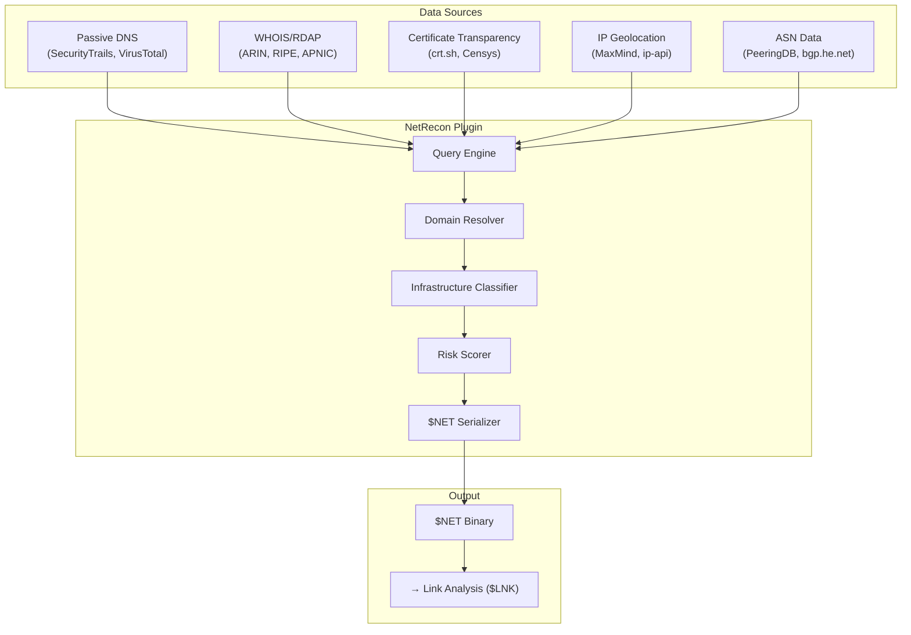

# 🌐 Network Reconnaissance Plugin

[](https://github.com/the-lobsternaut/netrecon-sdn-plugin/actions)
[](LICENSE)
[](https://en.cppreference.com/w/cpp/17)
[](https://github.com/the-lobsternaut)

**Passive network intelligence — DNS, WHOIS/RDAP, Certificate Transparency, subdomain enumeration, IP geolocation, ASN mapping, and infrastructure classification for OSINT.**

---

## Overview

The NetRecon plugin performs passive network reconnaissance to map internet infrastructure and identify organizations behind domains, IPs, and services. All techniques are passive (no port scanning, no intrusive probes).

### Capabilities

- **Passive DNS** — historical DNS resolution records and subdomain discovery
- **WHOIS/RDAP** — registrant information, creation/expiry dates, registrar
- **Certificate Transparency** — CT log queries for subdomain enumeration and cert history
- **IP geolocation** — lat/lon, city, country, ISP for IP addresses
- **ASN mapping** — AS number to organization, peering relationships
- **Infrastructure classification** — CDN, cloud (AWS/GCP/Azure), government (.gov/.mil), military
- **Risk scoring** — exposed services, expiring certs, privacy proxy usage

---

## Architecture



---

## Data Sources & APIs

| Source | URL | Type | Purpose |
|--------|-----|------|---------|
| **SecurityTrails** | [securitytrails.com](https://securitytrails.com/) | REST | Passive DNS, subdomains |
| **crt.sh** | [crt.sh](https://crt.sh/) | REST | Certificate Transparency logs |
| **ARIN RDAP** | [rdap.arin.net](https://rdap.arin.net/) | RDAP | North American IP WHOIS |
| **RIPE RDAP** | [rdap.db.ripe.net](https://rdap.db.ripe.net/) | RDAP | European IP WHOIS |
| **MaxMind GeoLite2** | [maxmind.com](https://www.maxmind.com/) | Database | IP geolocation |
| **PeeringDB** | [peeringdb.com](https://www.peeringdb.com/) | REST | ASN/peering data |

---

## Research & References

- **RFC 7482** — Registration Data Access Protocol (RDAP) Query Format.
- **RFC 9083** — JSON Responses for RDAP.
- **RFC 6962** — Certificate Transparency. CT log specification.
- Durumeric, Z. et al. (2013). ["ZMap: Fast Internet-wide Scanning"](https://doi.org/10.5555/2504730.2504755). *USENIX Security*. Internet scanning methodology context.
- **OWASP** — [Subdomain Enumeration](https://owasp.org/www-project-web-security-testing-guide/latest/4-Web_Application_Security_Testing/01-Information_Gathering/). Reconnaissance techniques.

---

## Technical Details

### Infrastructure Classification

| Type | Indicators |
|------|-----------|
| CDN | Cloudflare, Akamai, Fastly ASNs + CNAME patterns |
| Cloud | AWS IP ranges, GCP, Azure ASNs |
| Government | .gov, .mil TLDs, known gov IP ranges |
| Military | .mil, DoD IP space, SIPR/NIPR indicators |
| ISP | Residential/commercial ASN classification |

### Risk Scoring Factors

| Factor | Weight | Description |
|--------|--------|-------------|
| Expiring certs | High | SSL cert expiring within 30 days |
| Privacy proxy | Medium | WHOIS privacy = harder attribution |
| Exposed services | High | Known open ports from Censys/Shodan |
| Recently created | Medium | Domain < 90 days old |
| No DNSSEC | Low | Missing DNSSEC validation |

---

## Build Instructions

```bash
git clone --recursive https://github.com/the-lobsternaut/netrecon-sdn-plugin.git
cd netrecon-sdn-plugin

mkdir -p build && cd build
cmake ../src/cpp -DCMAKE_CXX_STANDARD=17
make -j$(nproc)
ctest --output-on-failure
```

---

## Usage Examples

```cpp
#include "netrecon/types.h"

netrecon::DomainRecord record{};
std::strncpy(record.domain, "example.com", 63);
record.registrar = "Cloudflare, Inc.";
record.created_epoch = 1609459200;
record.lat_deg = 37.7749;
record.lon_deg = -122.4194;
record.infra_type = netrecon::InfraType::CLOUD;
record.risk_score = 0.3f;

auto buffer = netrecon::serialize({record});
```

---

## Plugin Manifest

```json
{
  "schemaVersion": 1,
  "name": "netrecon",
  "version": "0.1.0",
  "description": "Network Reconnaissance — passive DNS, WHOIS/RDAP, CT logs, IP geolocation, ASN mapping.",
  "author": "DigitalArsenal",
  "license": "Apache-2.0",
  "inputFormats": ["application/json"],
  "outputFormats": ["$NET"]
}
```

---

## License

Apache-2.0 — see [LICENSE](LICENSE) for details.

---

*Part of the [Space Data Network](https://github.com/the-lobsternaut) plugin ecosystem.*
